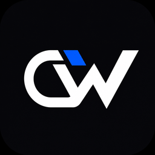
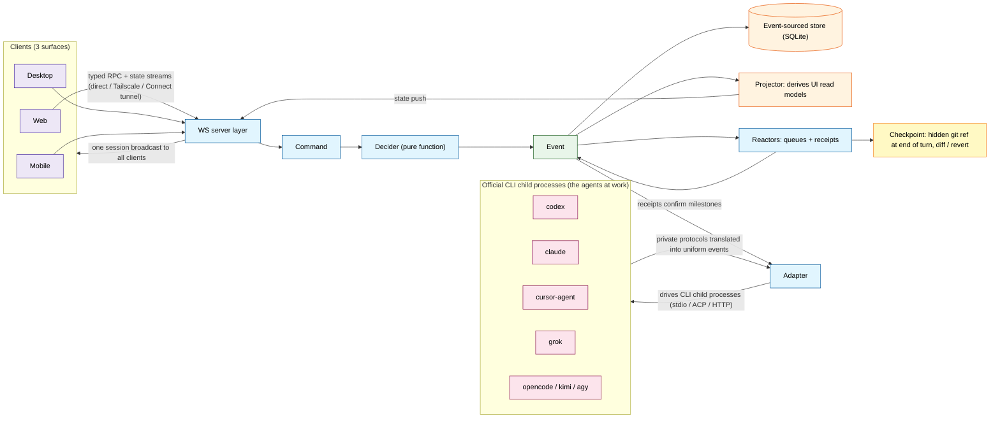
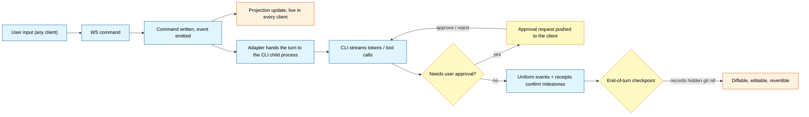

<div align="center">



# Code Work

A cross-platform AI coding workbench that brings coding agents, terminals, code changes, and remote environments into one reviewable workflow.

[简体中文](./README.md) | English | [日本語](./README.ja.md)

</div>

## What is Code Work?

Code Work is a unified web, desktop, and mobile workbench for developers who spend long stretches of time working with coding agents. It connects to the Codex, Claude, Cursor, Grok Build, and OpenCode CLIs already installed and logged in on your machine, keeping projects, threads, permissions, terminals, code changes, and remote control in a single workflow.

Code Work does not bundle these providers, and it does not manage their subscriptions or accounts on your behalf; it organizes what each provider offers into one consistent project workflow. You can run it locally, or pair another computer or phone to the machine running the server.

## How It Works

Code Work does not implement model calls itself: it launches, supervises, and drives the vendors' official CLI child processes, **translates their heterogeneous private protocols into one uniform stream of orchestration events**, persists everything as an event-sourced log, and pushes updates to every connected client. That is why web, desktop, and mobile all see the same session — and at the end of each turn a checkpoint (a hidden git ref) is recorded, so messages can be edited and resent, and work can be rolled back.



The flow of a single turn:



Model traffic does not have to leave through each CLI's own account either. The **Custom Model Services (BYOK)**, **CPA-compatible line**, and **local official account pool** in Settings are three traffic exits shareable with any provider instance. A local BYOK gateway (`/byok-gw/{protocol}/*`, token-authenticated) forwards requests by strict model-slug matching, and credentials live only in the server-side secret store — never in settings files, the page, or logs. See [BYOK & Custom Model Services](./docs/user/byok.md).

For the full architecture and glossary, see [docs/internals/glossary.md](./docs/internals/glossary.md).

## Repository Layout

This is a TypeScript / Effect-TS monorepo:

| Directory                 | Purpose                                                                             |
| ------------------------- | ----------------------------------------------------------------------------------- |
| `apps/server`             | WebSocket server, orchestration, provider adapters, persistence, remote connections |
| `apps/web`                | Browser workbench and settings UI                                                   |
| `apps/desktop`            | Electron desktop shell with local server launcher                                   |
| `apps/mobile`             | iOS and Android clients                                                             |
| `packages/contracts`      | WebSocket contracts and cross-surface data models                                   |
| `packages/client-runtime` | Client runtime shared by web and mobile                                             |
| `packages/shared`         | Cross-app utilities and product identity                                            |
| `docs/`                   | User docs, internal architecture notes, operations records                          |

## Highlights

- **Multi-provider workbench**: one place to see provider status, login state, binary paths, and enablement; each provider keeps using its own official CLI and account.
- **Projects and threads**: sessions organized per project with workspaces, worktrees, file search, terminals, source control, turn history, change review, and checkpoint restore.
- **Delegation and long tasks**: executor registration, availability probing, priorities and failover, plus review, retry, reassignment, budget escalation, visual delegation, and subagent personas.
- **Permissions and runtime control**: per-thread permission modes; the composition runtime handles task graphs, tool brokering, capability-grant approvals, and delegation handoff across restarts.
- **BYOK and custom models**: connect OpenAI, Anthropic, Gemini, and compatible relays with model discovery, context-window matching, balance queries, and usage dashboards.
- **Remote and multi-surface**: web, desktop, and mobile share contracts and the client runtime; pair via link, LAN, Tailscale, or the hosted web app to control your dev environment remotely.

## Getting Started

Regular users can download desktop installers for their platform from [GitHub Releases](https://github.com/Sakana-yuyu/code-work/releases).

Developing from source requires Node.js `24.13+`, pnpm, and Vite+:

```bash
pnpm install
pnpm dev          # start contracts / server / web in parallel
pnpm dev:desktop  # start the desktop development environment
vp i              # maintainer install of the Vite+ workspace
vp run dev        # maintainer local dev environment
```

Install and log in to at least one provider CLI; log in on whichever machine runs the server. Run type checks and tests scoped to your changes — repo-wide checks are not the daily verification loop.

## Documentation

- [Installation & first run](./docs/user/install.md)
- [Permission modes](./docs/user/permission-modes.md)
- [Keyboard shortcuts](./docs/user/keybindings.md)
- [Project icon settings](./docs/user/project-settings.md)
- [Message editor, slash commands & skills](./docs/user/composer.md)
- [Codex provider & CLI login](./docs/user/providers-codex.md)
- [BYOK & custom model services](./docs/user/byok.md)
- [BYOK Gateway support scope](./docs/user/byok-gateway.md)
- [Remote access from phone or another machine](./docs/user/remote-access.md)
- [App & server updates](./docs/user/updating.md)
- [Source control integration](./docs/user/source-control.md)
- [Claude provider](./docs/user/providers-claude.md)
- [Usage & plans](./docs/user/usage.md)
- [Agent CLI](./docs/user/agent-cli.md)
- [Linux background service](./docs/user/background-service.md)

## Platform Support

| Surface | Best for                       | Notes                                            |
| ------- | ------------------------------ | ------------------------------------------------ |
| Web     | Browser workbench, remote use  | Connects to local or remote Code Work servers    |
| Desktop | Daily driver                   | Electron shell with built-in local server runner |
| Mobile  | Remote control from your phone | iOS and Android clients for an existing server   |

## Desktop Builds & Releases

Stable desktop releases run on GitHub Actions' hosted builders; the workflow lives in
[`.github/workflows/release.yml`](./.github/workflows/release.yml). Pushing a stable tag like
`v1.2.3` builds the artifacts and creates the GitHub Release automatically; there is no manual
release entry today.

Current desktop release artifacts:

- Windows x64: NSIS installer
- macOS: arm64 and x64 installers
- Linux: x64 AppImage

The Linux `node-pty` needed by WSL ships only as a build helper inside the Windows installer; no
standalone Linux npm release is published. The release workflow only produces desktop artifacts and
the GitHub Release — no web deployment, AUR publishing, or Discord notifications, and no npm
packages yet. Building the desktop bundle, generating npm tarballs, or running `npx` build commands
requires no npm account; only uploading packages to the npm Registry needs an npm account with
publish rights.

## Recommended Path

1. Install and log in to one or more provider CLIs.
2. Start Code Work and create or pick a project.
3. Send a task in a project thread and pick a permission mode as needed.
4. Inspect agent output via terminals, source control, and change review.
5. For longer tasks, use delegation, review, retry, or reassignment.
6. When stepping away, create a pairing link in Settings and continue from a phone or another machine.

## Important Boundaries

- Provider CLIs, model subscriptions, and accounts are installed, logged in, and managed by you; Code Work never purchases or hosts them for you.
- The BYOK Gateway works per protocol as supported by the provider; protocols are not translated automatically.
- Remote access links and login credentials are sensitive — send them only to trusted devices and revoke them when no longer needed.

## Contributing

Please read [`CONTRIBUTING.md`](./CONTRIBUTING.md) first. Local development needs Vite+:

```bash
vp i
```

Propose features in the [Ideas discussions](https://github.com/Sakana-yuyu/code-work/discussions/categories/ideas) and file bugs as Issues.

## License

[MIT](LICENSE)

<!-- contributors-start -->
<!-- contributors-end -->
