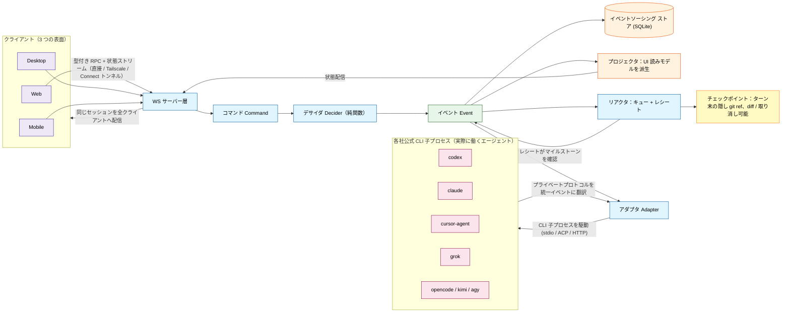
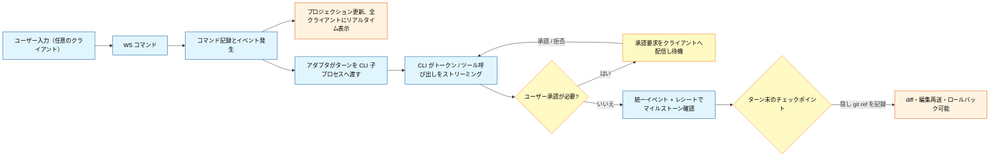

<div align="center">


# Code Work

コーディングエージェント・ターミナル・コード変更・リモート環境を、レビュー可能なひとつのワークフローにまとめるクロスプラットフォーム AI コーディングワークベンチ。

[简体中文](./README.md) | [English](./README.en-US.md) | 日本語

</div>

## プロジェクトの位置づけ

Code Work は、コーディングエージェントを長時間使い続ける開発者のために、Web・デスクトップ・モバイルを統合したワークベンチを提供します。ローカルマシンにインストール済み・ログイン済みの Codex、Claude、Cursor、Grok Build、OpenCode に接続し、プロジェクト・スレッド・権限・ターミナル・コード変更・リモート操作をひとつのワークフローに保ちます。

Code Work はこれらのプロバイダーを同梱せず、サブスクリプションやアカウントの管理も代行しません。各プロバイダーの能力を、一貫したプロジェクトワークフローに整理するのが役割です。ローカルで実行するほか、ペアリングリンクを使って別の PC やスマホからサーバー側マシンに接続することもできます。

## 動作の仕組み

Code Work 自身はモデル呼び出しを実装しません。各ベンダーの公式 CLI 子プロセスを起動・監視・駆動し、まちまちなプライベートプロトコルを**統一されたオーケストレーションイベントストリームに翻訳**します。すべてはイベントソーシングとして永続化され、接続中の全クライアントへ配信されます。そのため Web・デスクトップ・モバイルが同じセッションを共有でき、各ターンの終わりにはチェックポイント（隠し git ref）が記録され、メッセージの編集・再送やロールバックが可能です。



ひとつのターンの流れ：



モデルのトラフィックを各 CLI 自身のアカウントから出す必要もありません。設定の「カスタムモデルサービス（BYOK）」「CPA 互換ライン」「ローカル公式アカウントプール」は、任意のプロバイダーインスタンスに共有できる 3 つのトラフィック出口です。ローカルの BYOK ゲートウェイ（`/byok-gw/{protocol}/*`、トークン認証付き）がモデル slug の厳格一致で転送し、認証情報はサーバー側の secret store にのみ保存されます。設定ファイル・画面・ログに現れることはありません。詳細は [BYOK とカスタムモデルサービス](./docs/user/byok.md)。

アーキテクチャと用語の詳細は [docs/internals/glossary.md](./docs/internals/glossary.md) を参照してください。

## リポジトリ構成

TypeScript / Effect-TS のモノレポです：

| ディレクトリ              | 説明                                                                                 |
| ------------------------- | ------------------------------------------------------------------------------------ |
| `apps/server`             | WebSocket サーバー、オーケストレーション、プロバイダーアダプタ、永続化とリモート接続 |
| `apps/web`                | ブラウザワークベンチと設定 UI                                                        |
| `apps/desktop`            | Electron デスクトップシェルとローカルサーバー起動                                    |
| `apps/mobile`             | iOS / Android クライアント                                                           |
| `packages/contracts`      | WebSocket 契約とクロスサーフェスのデータモデル                                       |
| `packages/client-runtime` | Web とモバイルで共有するクライアントランタイム                                       |
| `packages/shared`         | アプリ横断ユーティリティとプロダクト識別                                             |
| `docs/`                   | ユーザードキュメント・内部アーキテクチャ・運用記録                                   |

## 主な機能

- **マルチプロバイダーワークベンチ**：プロバイダーの状態・ログイン・バイナリパス・有効化設定を一画面で確認。各プロバイダーは引き続き公式 CLI とアカウントを使います。
- **プロジェクトとスレッド**：プロジェクト単位でセッションを整理。ワークスペース、worktree、ファイル検索、ターミナル、ソース管理、ターン履歴、変更レビュー、チェックポイント復元に対応。
- **タスク委譲と長時間タスク**：エグゼキュータ登録、可用性プローブ、優先度とフェイルオーバーに加え、レビュー・リトライ・再割り当て・予算引き上げ・ビジュアル委譲・サブエージェントペルソナに対応。
- **権限とランタイム制御**：スレッドごとの権限モード。コンポジションランタイムがタスクグラフ、ツールブローカー、権限付与の承認、再起動をまたぐ委譲の回収を担当。
- **BYOK とカスタムモデル**：OpenAI・Anthropic・Gemini 互換のリレーに接続。モデルディスカバリ、コンテキストウィンドウ一致、残高照会、使用量ダッシュボードに対応。
- **リモートとマルチサーフェス**：Web・デスクトップ・モバイルが契約とクライアントランタイムを共有。ペアリングリンク・LAN・Tailscale・ホスト型 Web アプリで開発環境をリモート操作。

## はじめに

一般ユーザーは [GitHub Releases](https://github.com/Sakana-yuyu/code-work/releases) から各プラットフォームのデスクトップインストーラをダウンロードできます。

ソースから開発するには Node.js `24.13+`、pnpm、Vite+ が必要です：

```bash
pnpm install
pnpm dev          # contracts / server / web を並列起動
pnpm dev:desktop  # デスクトップ開発環境を起動
vp i              # メンテナ向け Vite+ ワークスペースのインストール
vp run dev        # メンテナ向けローカル開発環境
```

最低ひとつのプロバイダー CLI をインストールしてログインしてください。サーバーが動いているマシン上でプロバイダーのログインを行います。型チェックとテストは変更範囲に絞って実行し、リポジトリ全体のチェックを日常の検証の唯一の手段にしないでください。

## ドキュメント

- [インストールと初回実行](./docs/user/install.md)
- [権限モード](./docs/user/permission-modes.md)
- [キーボードショートカット](./docs/user/keybindings.md)
- [プロジェクトアイコン設定](./docs/user/project-settings.md)
- [メッセージエディタ・スラッシュコマンド・スキル](./docs/user/composer.md)
- [Codex プロバイダーと CLI ログイン](./docs/user/providers-codex.md)
- [BYOK とカスタムモデルサービス](./docs/user/byok.md)
- [BYOK Gateway の対応範囲](./docs/user/byok-gateway.md)
- [スマホや別マシンからのリモートアクセス](./docs/user/remote-access.md)
- [アプリとサーバーの同期](./docs/user/updating.md)
- [ソースコントロール統合](./docs/user/source-control.md)
- [Claude プロバイダー](./docs/user/providers-claude.md)
- [使用量とプラン](./docs/user/usage.md)
- [Agent CLI](./docs/user/agent-cli.md)
- [Linux バックグラウンドサービス](./docs/user/background-service.md)

## プラットフォーム対応

| 表面    | 適した場面                     | 説明                                           |
| ------- | ------------------------------ | ---------------------------------------------- |
| Web     | ブラウザワークベンチ・リモート | ローカル/リモートの Code Work サーバーに接続   |
| Desktop | 日常のメイン環境               | Electron シェル、ローカルサーバー起動を内蔵    |
| Mobile  | スマホからのリモート操作       | iOS / Android クライアント、既存サーバーに接続 |

## デスクトップのビルドとリリース

安定版デスクトップリリースは GitHub Actions のホストされたビルドマシンを使用します。ワークフローは
[`.github/workflows/release.yml`](./.github/workflows/release.yml) にあります。`v1.2.3`
形式の安定版タグを push すると、自動でビルドと GitHub Release の作成が行われます。手動リリース入口は現在ありません。

現在のデスクトップリリース成果物：

- Windows x64：NSIS インストーラ
- macOS：arm64 と x64 インストーラ
- Linux：x64 AppImage

WSL に必要な Linux `node-pty` は Windows インストーラのビルド補助としてのみ同梱され、Linux 向け npm パッケージは単独では公開されません。このリリースワークフローはデスクトップ成果物と GitHub Release のみを担当し、Web デプロイ・AUR 公開・Discord 通知は行わず、npm パッケージも未公開です。デスクトップバンドルのビルド、npm tarball の生成、`npx` ビルドコマンドの実行に npm アカウントは不要です。npm Registry へのアップロード時のみ、公開権限のある npm アカウントが必要です。

## 推奨ユースパス

1. プロバイダー CLI をインストールしてログインします。
2. Code Work を起動し、プロジェクトを作成または選択します。
3. プロジェクトスレッドでタスクを送信し、必要に応じて権限モードを選択します。
4. ターミナル・ソース管理・変更レビューでエージェントの出力を確認します。
5. 長時間タスクには委譲・レビュー・リトライ・再割り当てを使います。
6. PC を離れるときは設定でペアリングリンクを作成し、スマホや別マシンから続行します。

## 重要な境界

- プロバイダー CLI・モデルサブスクリプション・アカウントはユーザー自身がインストール・ログイン・管理します。Code Work が購入やホスティングを代行することはありません。
- BYOK Gateway はプロバイダーが対応するプロトコル単位で動作し、プロトコル間の自動変換は行いません。
- リモートアクセスのリンクとログイン情報は機密情報です。信頼できるデバイスにのみ送り、不要になったら取り消してください。

## コントリビューション

まず [`CONTRIBUTING.md`](./CONTRIBUTING.md) をお読みください。ローカル開発には Vite+ が必要です：

```bash
vp i
```

機能の提案は [Ideas ディスカッション](https://github.com/Sakana-yuyu/code-work/discussions/categories/ideas)へ、不具合は Issue へお願いします。

## License

[MIT](LICENSE)

<!-- contributors-start -->
<!-- contributors-end -->
