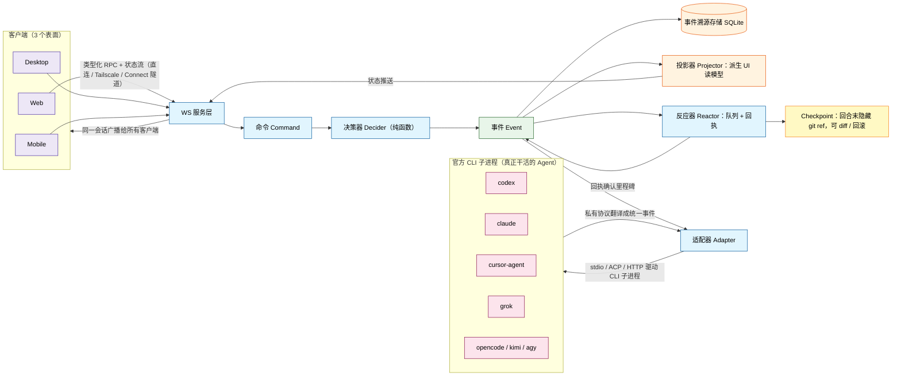
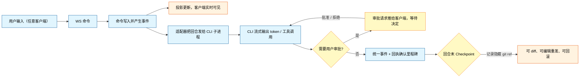

<div align="center">


# Code Work

一个跨平台的 AI 编程工作台：把编码代理、终端、代码变更和远程环境放进同一个可审查的工作流。

简体中文 | [English](./README.en-US.md) | [日本語](./README.ja.md)

</div>

## 项目定位

Code Work 面向需要长时间使用编码代理的开发者，提供统一的 Web、桌面和移动端工作台。它连接你本机已经安装并完成登录的 Codex、Claude、Cursor、Grok Build 与 OpenCode，让项目、线程、权限、终端、代码变更和远程控制保持在同一个工作流中。

Code Work 不捆绑这些 Provider，也不代替它们管理订阅或账号；它负责把不同 Provider 的能力组织成一致的项目工作流。你可以在本机运行，也可以通过配对链接从另一台电脑或手机连接到运行服务的机器。

## 工作原理

Code Work 自己不实现模型调用：它启动、监视并驱动各家官方 CLI 子进程，把它们的私有协议**翻译成统一的编排事件流**，以事件溯源方式持久化，再推送给所有在线客户端。因此 Web、桌面、手机看到的是同一个会话，回合结束后还会打一个 checkpoint（隐藏 git ref），消息可以编辑重发、可以回滚。



一次对话回合的流转：



模型流量也可以不走出各家 CLI 自己的账号：设置里的「自定义模型服务（BYOK）」「CPA 兼容线路」和「本地官方账号池」是三条可共享给任意 Provider 实例的流量出口，由本机 BYOK 网关（`/byok-gw/{protocol}/*`，带令牌鉴权）按模型 slug 严格匹配转发，凭据只保存在服务端 secret store，不会出现在设置文件、页面或日志里。详见 [BYOK 与自定义模型服务](./docs/user/byok.md)。

架构与术语的完整说明见 [docs/internals/glossary.md](./docs/internals/glossary.md)。

## 项目结构

这是一个 TypeScript / Effect-TS monorepo：

| 目录                      | 说明                                                        |
| ------------------------- | ----------------------------------------------------------- |
| `apps/server`             | WebSocket 服务、任务编排、Provider 适配器、持久化与远程连接 |
| `apps/web`                | 浏览器工作台与设置界面                                      |
| `apps/desktop`            | Electron 桌面端及本地服务启动器                             |
| `apps/mobile`             | iOS 与 Android 移动端                                       |
| `packages/contracts`      | WebSocket 契约与跨端数据模型                                |
| `packages/client-runtime` | Web 与移动端共享的客户端运行时                              |
| `packages/shared`         | 跨应用共享工具与产品标识                                    |
| `docs/`                   | 用户文档、内部架构说明和运维记录                            |

## 核心能力

- **多 Provider 工作台**：统一查看 Provider 状态、登录状态、可执行文件路径和启用配置；不同 Provider 仍使用各自的官方 CLI 与账号。
- **项目与线程**：按项目组织会话，支持工作区、worktree、文件搜索、终端、源码控制、回合历史、变更查看与检查点恢复。
- **IDE 工作区**：在同一项目内切换对话与 IDE 布局；IDE 复用 Code Work 的文件、终端、Git、主题和远程 SSH 能力，并支持中文 VS Code 工作台界面。
- **任务委派与长任务**：提供执行器注册、可用性探测、优先级与故障转移，并支持审查、重试、改派、预算升级、视觉委派和子代理角色。
- **权限与运行时控制**：按线程选择权限模式；组合运行时负责任务图、工具代理、能力授予审批，以及跨重启委派收口。
- **BYOK 与自定义模型**：接入 OpenAI、Anthropic、Gemini 及兼容中转，支持模型发现、上下文窗口匹配、余额查询和使用量仪表盘。
- **远程与多端协同**：Web、桌面和移动端共享契约与客户端运行时，可通过配对链接、局域网、Tailscale 或托管 Web 端远程控制开发环境。

## 快速开始

普通用户可以从 [GitHub Releases](https://github.com/Sakana-yuyu/code-work/releases) 下载对应平台的桌面安装包。

从源码开发需要 Node.js `24.13+`、pnpm 和 Vite+：

```bash
pnpm install
pnpm dev          # 并行启动 contracts / server / web
pnpm dev:desktop  # 启动桌面端开发环境
vp i              # 维护者安装 Vite+ 工作区依赖
vp run dev        # 维护者启动本地开发环境
```

至少安装并登录一个 Provider CLI；服务端在哪台机器运行，就在哪台机器完成 Provider 登录。类型检查和测试请按改动范围运行，不要把全仓检查当作日常开发的唯一验证方式。

## 文档

- [安装与首次运行](./docs/user/install.md)
- [权限模式](./docs/user/permission-modes.md)
- [键盘快捷键](./docs/user/keybindings.md)
- [项目图标设置](./docs/user/project-settings.md)
- [消息编辑器、斜杠命令与技能](./docs/user/composer.md)
- [Codex Provider 与 CLI 登录](./docs/user/providers-codex.md)
- [BYOK 与自定义模型服务](./docs/user/byok.md)
- [BYOK Gateway 支持范围](./docs/user/byok-gateway.md)
- [从手机或另一台机器远程访问](./docs/user/remote-access.md)
- [应用与服务端同步](./docs/user/updating.md)
- [源码控制集成](./docs/user/source-control.md)
- [IDE 工作区](./docs/user/workspace-ide.md)
- [Claude Provider](./docs/user/providers-claude.md)
- [使用量与计划](./docs/user/usage.md)
- [Agent CLI](./docs/user/agent-cli.md)
- [Linux 后台服务](./docs/user/background-service.md)

## 平台支持

| 端      | 适用场景               | 说明                                |
| ------- | ---------------------- | ----------------------------------- |
| Web     | 浏览器工作台、远程访问 | 可连接本机或远程 Code Work 服务     |
| Desktop | 日常主力使用           | Electron 外壳，内置本地服务启动能力 |
| Mobile  | 手机端远程控制         | iOS 与 Android 客户端，连接已有服务 |

## 桌面端构建与发布

桌面 Release 使用 GitHub Actions 的官方托管构建机器，工作流位于
[`.github/workflows/release.yml`](./.github/workflows/release.yml)。推送形如 `v1.2.3`
的稳定版本 tag 会创建 latest Release；推送形如 `v1.2.3-battle` 的 battle tag 会创建
预发布 Release，不会覆盖 latest。两种发布均由同一套桌面构建矩阵完成。

当前桌面 Release 包含以下产物：

- Windows x64：NSIS 安装包
- macOS：arm64 与 x64 安装包
- Linux：x64 AppImage

WSL 所需的 Linux `node-pty` 只作为 Windows 安装包的构建辅助文件，不会单独发布 Linux
版本。这个 Release 工作流只负责桌面产物和 GitHub Release，不执行 Web 部署、AUR 发布或
Discord 通知，也暂不发布 npm 包。构建桌面包、生成 npm 压缩包或运行 `npx` 构建命令不需要
npm 账户；只有将包上传到 npm Registry 时才需要 npm 账户和对应的发布权限。

## 推荐使用路径

1. 安装并登录一个或多个 Provider CLI。
2. 启动 Code Work，创建或选择一个项目。
3. 在项目线程中发送任务，并按需要选择权限模式。
4. 通过终端、源码控制和变更查看检查代理输出。
5. 需要更长任务时使用委派、审查、重试或改派。
6. 需要离开电脑时，在设置中创建配对链接，用手机或另一台机器继续操作。

## 重要边界

- Provider CLI、模型订阅和账号由用户自行安装、登录和管理；Code Work 不会替你购买或托管这些服务。
- BYOK Gateway 按 Provider 支持的协议工作；不同协议之间不会自动转换。
- 远程访问链接和登录凭据属于敏感信息，只应发送给可信设备，并在不再需要时撤销。

## 贡献

请先阅读 [`CONTRIBUTING.md`](./CONTRIBUTING.md)。本地开发需要 Vite+：

```bash
vp i
```

功能建议请提交 [Ideas 讨论](https://github.com/Sakana-yuyu/code-work/discussions/categories/ideas)，问题反馈请提交 Issue。

## License

[MIT](LICENSE)

<!-- contributors-start -->
<!-- contributors-end -->
