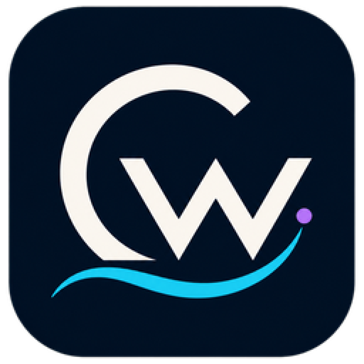

<div align="center">



# Code Work

一个独立的桌面 AI 开发工作台：现代工作台界面壳 + 可自持密钥（BYOK）的多模型运行时。

</div>

## 项目结构

仓库包含两条产品线：

| 目录 | 说明 |
| --- | --- |
| `codework/` | 主线（TypeScript / Effect-TS monorepo）：`apps/server` 组合运行时、`apps/web` 工作台前端、`apps/desktop` 桌面端、`apps/mobile`，以及 `packages/contracts`、`packages/client-runtime` 等共享包 |
| `internal/` + `frontend/` | 早期 Go + Wails 桌面工作台线（现作为参考与工具线维护） |

## 核心能力

- **BYOK 多供应商**：自带密钥接入 OpenAI / Anthropic / Gemini 及各类兼容中转，模型目录发现、上下文窗口匹配、余额查询与仪表盘。
- **任务委派**：内置执行器注册表（多执行器候选、可用性探测、优先级与故障转移）、监督委派（审查 / 重试 / 改派 / 升级预算）、视觉委派、子代理角色片段，以及 Agent Loop 内的模型自发 `delegate_task` 子代理委派。
- **组合运行时**：任务图编排、工具代理（ToolBroker）与能力授予审批、跨重启委派收口与台账投影。
- **多端**：Web、桌面（Electron）、移动端共享同一套契约与运行时。

## 快速开始

```bash
pnpm install
pnpm dev          # 并行启动 contracts / server / web
pnpm dev:desktop  # 桌面端
pnpm tc           # 全仓类型检查
pnpm test         # 全仓测试
```

要求 Node.js 24+（服务端以 Node 直跑 TS 源码）。BYOK 与委派的配置说明见 `codework/docs/user/byok.md`，更多内部设计文档见 `codework/docs/`。

## 当前状态

- 底层基线：`cursor-byok` 提交 `9ac2f25ea77b7db666b5dbcf2ca2ea4dd4538edc`。
- 产品数据与现有 cursor-byok 隔离；不会自动读取、迁移或删除其配置、账号、证书和历史记录。
- VS Code 与 OpenAI Codex 仅作为本地参考源码，用于研究信息架构、交互与可访问性；其源码和品牌资产不进入本项目的产品代码或构建产物。

详细的参考来源记录见 `docs/reference-provenance.md`。

## License

[MIT](LICENSE)。`codework/` 子树保留其上游版权声明（见 `codework/LICENSE`）。

<!-- contributors-start -->
<table><tr>
<td><a href="https://github.com/Sakana-yuyu/code-work"></a></td>
</tr></table>
<!-- contributors-end -->
