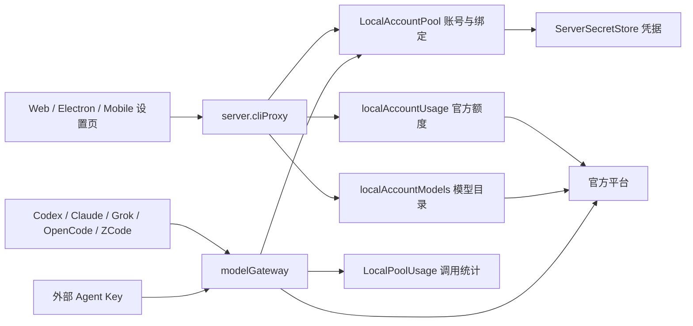

# Agent、CLI 账号池与转发：实现与上游对照

本文描述当前实现、接口边界和验证方法。检索日期：2026-09-29；本次修改基于 Code Work `b1903c2ed`。源码对照不等于真实账号联调，测试响应也不代表某个账号实际拥有对应模型或余额。

## 1. 架构与职责



客户端只提交类型化操作与账号 ID。服务端验证管理权限，从密钥存储读取真实令牌，选择账号并向官方端点转发。账号列表、订阅快照、调用计数是三个不同的数据面，不能用“账号启用”推断令牌有效，也不能用调用 token 数反推官方余额。

| 职责                   | 实现位置                                                        | 约束                                                      |
| ---------------------- | --------------------------------------------------------------- | --------------------------------------------------------- |
| RPC 请求与返回值       | `packages/contracts/src/cliProxy.ts`                            | `server.cliProxy` 使用终端管理权限；凭据不进入摘要        |
| 导入、启停、权重、绑定 | `apps/server/src/provider/LocalAccountPool.ts`                  | 更新复用设置存储；凭据使用服务端密钥存储                  |
| 操作协调               | `apps/server/src/provider/CliProxy.ts`                          | 同一服务协调账号、目录、外部 Key 和本机登录扫描           |
| 额度与订阅查询         | `apps/server/src/provider/localAccountUsage.ts`                 | 一次全池查询最多并行 4 个账号；单账号请求不访问其他账号   |
| 体验套餐与活动         | `apps/server/src/provider/zcode/zcodeStartPlan.ts`              | Key 和 JWT 各走自己的接口；验证码由客户端获取             |
| 模型目录               | `apps/server/src/provider/localAccountModels.ts`                | 明确区分 `provider` 与 `catalog`，静态目录不证明账号权限  |
| 协议转发               | `apps/server/src/provider/byok/modelGateway.ts`                 | 选号、刷新、冷却、换号、流式统计；流交付后不重放          |
| Web 与 Electron        | `apps/web/src/components/settings/CliProxySettingsSection.tsx`  | Electron 复用 Web；登录卡、模型弹窗、活动弹窗独立负责交互 |
| 移动端                 | `apps/mobile/src/features/settings/CliProxySettingsSection.tsx` | 共享 RPC 和快照合并；使用原生控件展示订阅与额度           |

## 2. 原始项目与采用依据

采用官方仓库和维护者文档，避免把第三方仪表盘的字段猜测当成官方协议。外部源码仅在工作区外用于对照，不引入新的运行时依赖。

| 项目与检索关键词                                                                 | 采用的来源                                                                                                                                                                                                                    | 与 Code Work 的关系                                                                                                                 |
| -------------------------------------------------------------------------------- | ----------------------------------------------------------------------------------------------------------------------------------------------------------------------------------------------------------------------------- | ----------------------------------------------------------------------------------------------------------------------------------- |
| CLIProxyAPI：`management quota/fetch auth_index`                                 | [源码快照 a270e7b9](https://github.com/router-for-me/CLIProxyAPI/tree/a270e7b9e57aaecd8f82555f44c2108518ad2330)，重点 `internal/api/handlers/management/plugin_quota.go`、`internal/api/server_management_v8.go`              | 上游按凭据索引查询额度，插件或声明式探针提供数据，无实现时明确拒绝。我们使用类型化 RPC 和内置平台适配；没有声称兼容全部 v8 管理接口 |
| ZCode：`percentage normalizeStartPlanExpiry billing/balance`                     | [源码快照 29628c9a](https://github.com/zai-org/ZCode/tree/29628c9acdb81b703bbd4080c207a0e7ce5e276e)，重点 `packages/services/src/model-provider/zaiStartPlanBilling.ts`、`packages/ui/src/lib/codingPlanQuotaPresentation.ts` | 确认 Coding Plan 百分比已经是百分数、套餐按实例归属过滤过期余额；修正本地解析和局部失败行为                                         |
| Codex：`authentication ChatGPT API key`                                          | [官方认证说明](https://developers.openai.com/codex/auth/)，并对照 CPA 的 `internal/runtime/executor/helps/codex_quota.go`                                                                                                     | ChatGPT 登录与 API Key 是不同身份。账号池分别使用官方 OAuth 与 API 端点，不把 ChatGPT 套餐当成 API 现金余额                         |
| Claude Code：`authentication subscription API key`                               | [官方认证说明](https://code.claude.com/docs/en/authentication)                                                                                                                                                                | OAuth 用量和组织 API 计费不是同一个数据源；普通推理 Key 不虚构账号总余额                                                            |
| Grok：`CLI settings authentication`                                              | [官方设置文档](https://docs.x.ai/build/settings)；现有适配器中的 CLI billing 协议                                                                                                                                             | 保留 OAuth CLI 与 xAI API Key 的区别；CLI billing 的实际响应仍需真实账号核验                                                        |
| Cursor：`CLI authentication CURSOR_API_KEY`                                      | [官方认证说明](https://cursor.com/docs/cli/reference/authentication)                                                                                                                                                          | 官方支持浏览器登录与 API Key；当前采用 ACP 进程环境注入，不能把 HTTP 网关重试套到已启动的 ACP 会话                                  |
| OpenCode：`providers custom baseURL`                                             | [官方 Providers 文档](https://opencode.ai/docs/providers/)                                                                                                                                                                    | OpenCode 是消费模型线路的 Agent，不是本地账号池中的一个余额供应商；当前绑定使用 Codex API Key 或 Grok 来源                          |
| cc-switch：`max_retries failover usage_cache subscription`                       | [源码快照 a1216b7e](https://github.com/farion1231/cc-switch/tree/a1216b7e359466be98f3c783cc290e7040de26d4)，`src-tauri/src/proxy/forwarder.rs`、`src-tauri/src/services/usage_cache.rs`                                       | 官方远端重新获取；重试上限为重试次数加一，受候选数量限制；受管账号额度按账号缓存，不与 CLI 全局订阅混用                             |
| Sub2API：`getBatchUsage recoverState refreshOpenAIQuota resetOpenAIQuota sticky` | [源码快照 a60a2954](https://github.com/Wei-Shaw/sub2api/tree/a60a29549f488a854966aaec9541abbe006cac22)，`frontend/src/api/admin/accounts.ts`、`backend/internal/service/openai_account_scheduler.go`                          | 区分主动/被动查询、按账号批量结果与错误、可调度状态和运行态恢复；其额度重置会消耗不可退还次数，不能与普通刷新合并                   |

### 能力对照

| 能力               | 原始项目的能力或边界                                  | 当前实现及本次处理                                                                                     |
| ------------------ | ----------------------------------------------------- | ------------------------------------------------------------------------------------------------------ |
| 单账号额度查询     | CPA 提供凭据索引查询                                  | `localAccountUsage` 增加可选 `id`，卡片按钮只查当前账号                                                |
| 模型默认目录       | 各 CLI 有自己的目录与账号权限                         | UI、BYOK 发布目录、实际网关统一复用 `LOCAL_POOL_DEFAULT_MODELS`；没有声明模型的账号仍可参与路由        |
| 同模型多账号       | 调度账号和列出模型是不同维度                          | 发布时按稳定线路 ID 去重，选号时继续保留所有符合条件的账号                                             |
| 暂停后恢复         | 暂停不应丢失账号来源绑定                              | 全部禁用时目录清空，持久化绑定保留；启用或后续状态协调时重建目录，重启后仍能识别连接                   |
| 额度单位           | ZCode `percentage` 是已用百分数                       | 去掉“小于等于 1 就乘 100”的猜测；`0.5` 显示为已用 `0.5%`                                               |
| 多套套餐           | ZCode 余额按商品和用户套餐实例归属                    | 显式 expired 和到期 active 不提供旧余额；同商品其他有效实例继续显示                                    |
| 部分失败           | Coding Plan 与体验套餐使用不同身份                    | Key 查询失败不抹掉 JWT 体验余额；保留局部错误说明                                                      |
| 活动领取           | 上游验证码、域名及活动资格决定结果                    | 成功由服务端回执决定；RPC 失败显示在弹窗；关闭销毁验证码实例并忽略迟到回调                             |
| API 完整性         | CPA v8 还包含插件等管理功能                           | 本项目有明确的兼容子集；没有实现的插件、重置额度、下载凭据等不能用假成功代替                           |
| 批量查询与错误隔离 | Sub2API 返回按账号映射的 usage/errors                 | 本项目返回按 ID 关联的 subscriptions，每项可含 error，客户端合并单账号快照；不因为一项失败清空其他账号 |
| 调度与会话保持     | Sub2API 在黏性会话选择中检查额度、团队模型冷却等条件  | 当前使用轮询、优先用满、权重轮询及已有冷却；没有复制 Sub2API 多租户团队调度、计费与后台任务体系        |
| 额度快照身份       | cc-switch 分开保存官方订阅、受管 OAuth 账号和脚本结果 | 当前按账号 ID 合并官方快照，查询时间明确可见；本地调用统计单独显示，不当成余额                         |
| 额度恢复           | Sub2API 的 quota refresh 与 reset-credit 消耗分离     | 当前刷新只读取额度；没有提供购买、消耗次数、重置官方额度等财务操作                                     |

## 3. 按钮与实际行为

下表是当前账号池页的操作合同。静态追踪覆盖这些入口；定向回归和真实浏览器验收范围见第 7 节。外部授权、验证码和真实推理不能用本地按钮反馈代替验收。

| 页面操作                       | 实际处理                                     | 成功、失败与限制                                                                         |
| ------------------------------ | -------------------------------------------- | ---------------------------------------------------------------------------------------- |
| 页面刷新                       | `localAccountUsage`                          | 返回当前账号摘要、统计和官方额度；不存在的数据不补零                                     |
| 刷新账号列表                   | `localAccounts`                              | 刷新元数据；保留此前查询到的额度快照                                                     |
| 单账号刷新                     | `localAccountUsage { id }`                   | 更新指定账号及其查询时间，不覆盖其他账号余额                                             |
| 登录添加账号                   | `CliProxyLoginCard` 调用官方登录流程         | 结束后导入凭据并刷新额度；本机扫描失败可见                                               |
| 本机登录态导入                 | `scanNativeAccounts` → `importNativeAccount` | 服务端重新验证候选路径；导入失败不提前隐藏该账号                                         |
| 文件或粘贴导入                 | `importLocalAccount`                         | 服务端解析格式；文件大小限制 1 MiB，ID 最长 96；成功后清空上次输入，防止误覆盖下一个账号 |
| 搜索、平台过滤、认证过滤、排序 | 本地派生账号列表                             | 不改服务端账号；过滤后选择仍按真实账号 ID 操作                                           |
| 网格或列表视图                 | 本地布局切换                                 | 共享同一数据与操作；长额度标签可换行                                                     |
| 勾选、全选、批量启停           | `setLocalAccountsEnabled`                    | 按所选 ID 更新；删除账号后清理残留选择                                                   |
| 单账号启停                     | `setLocalAccountEnabled`                     | 不存在的账号返回错误；禁用不删除凭据或来源绑定                                           |
| 调度策略                       | `setLocalAccountPoolStrategy` / `configure`  | 轮询、优先用满、加权轮询；以服务端回执更新选中状态                                       |
| 权重编辑                       | `setLocalAccountWeight`                      | 1–99；Web 失焦后提交，避免每次按键触发请求和锁定输入                                     |
| 删除账号                       | `deleteLocalAccount`                         | Web 二次确认；凭据与设置按现有回滚逻辑处理，旧额度快照随摘要移除                         |
| 拉取模型                       | `fetchLocalAccountModels`                    | OAuth 先复用凭据刷新；官方查询失败可回静态目录，UI 标注来源                              |
| 保存模型                       | `setLocalAccountModels`                      | 合并目录与已声明的自定义模型；保存失败保留选择和弹窗；空选择恢复不限模型                 |
| 一键接入共享线路               | `connectByok`                                | 默认模型账号也纳入绑定；多个账号同模型只发布一条线路                                     |
| 发布到 CLI 实例                | `publishLocalAccountPool`                    | 校验实例驱动与平台组合，不支持的组合明确失败                                             |
| 管理已接入线路                 | `onConnected` / 移动端 `onManageRoutes`      | 跳转相应 Provider 配置入口                                                               |
| 创建、轮换、撤销外部 Key       | 对应 ExternalGatewayKey RPC                  | 明文只在创建或轮换结果中提供；状态合并不缓存旧明文                                       |
| 领取活动                       | `claimLocalAccountOffer`                     | 展示真实成功或错误；成功后重查该账号额度；验证码未就绪不可点击                           |
| 高级配置、说明、关闭弹窗       | 本地显示状态                                 | 不伪装成服务器配置写入；领取中阻止关闭，防止回执落到另一个活动                           |

## 4. 余额、订阅与模型接口

### RPC 返回合同

```ts
// 全池查询；兼容原请求。
{ action: "localAccountUsage" }

// 新客户端的账号卡刷新。
{ action: "localAccountUsage", id: "account-a" }

// accountSubscriptions 的每个元素：
{
  id: "account-a",
  fetchedAt: "2026-09-29T14:00:00.000Z",
  plan: "Pro",                 // 可选，官方套餐名
  status: "已达上限",          // 可选，上游状态
  expiresAt: "...",            // 可选，订阅到期时间
  windows: [{ label: "5 小时", percent: 25, resetsAt: "..." }],
  metrics: [{ label: "积分余额", value: "12.34567890" }],
  detail: "...",               // 可选，能力限制或部分查询失败
  error: "..."                 // 可选，无法取得当前查询数据
}
```

`percent` 始终表示已使用百分数。额度窗口、积分、调用 token、货币金额不互换单位。Codex 积分保留上游字符串精度，不附加未经确认的美元符号；这里没有扣款、充值、分账或余额账本操作。

`fetchedAt` 是查询完成时间，不保证上游账单实时结算。请求成功但无公开额度能力，返回空窗口和限制说明；鉴权失败、网络失败、业务错误分别保留错误反馈。HTTP 200 不能覆盖响应信封中的业务失败。

`mergeCliProxyResult` 按账号 ID 合并订阅数据：普通状态刷新保留快照，单账号刷新只替换该账号，账号被删除则删除其快照；外部 Key 的一次性明文不继承。Web、Electron 和 Mobile 复用同一规则。页面切换环境或卸载时递增请求代次，旧结果不得覆盖新环境状态。

### 平台覆盖

| 平台 / 身份           | 查询入口与返回内容                                                                       | 明确边界                                                              |
| --------------------- | ---------------------------------------------------------------------------------------- | --------------------------------------------------------------------- |
| Codex OAuth           | `chatgpt.com/backend-api/wham/usage`，可选 subscriptions；窗口、额外模型限额、积分、套餐 | `id_token` 兼容命名空间内的套餐字段；不推导 API 平台余额              |
| Codex API Key         | 当前无账号总余额适配；模型使用默认目录                                                   | 不把缺少账单管理权限显示成余额 0                                      |
| Claude OAuth          | `api.anthropic.com/api/oauth/usage` 与 profile；5 小时、周窗、细分模型、套餐             | profile 可选数据不阻断主用量；官方协议变更需真实账号复核              |
| Claude API Key        | `/v1/models` 可查模型；无账号总余额适配                                                  | 普通推理 Key 不等于组织账单管理凭据                                   |
| Grok OAuth            | CLI billing 周/月查询                                                                    | 一个失败保留另一个；均失败显示错误；不得将 401 描述为“付费档没有接口” |
| xAI API Key           | `/v1/api-key` 元数据，`/v1/models` 模型                                                  | 元数据不是可用余额                                                    |
| ZCode Coding Plan Key | biz subscription、monitor quota、活动统计                                                | `percentage` 直接按百分数使用；不混用体验 JWT                         |
| ZCode JWT             | billing balance / preview、client configs                                                | 返回体验套餐、余额桶、可领取活动；显式过期套餐不提供余额              |
| ZCode Key + JWT       | 上述数据组合，可附 MCP 用量                                                              | 一套身份失败时保留另一套；JWT-only 不向 Coding Plan 监控接口发送 JWT  |
| Cursor                | 当前无公开额度适配；ACP 凭据注入                                                         | 页面明确能力边界，不实现未核实的私有余额接口                          |
| OpenCode              | 由所绑定的供应商账号提供额度                                                             | 没有独立的 OpenCode 账号池余额                                        |

官方账号查询前复用 `ensureLocalAccountCredential`，它按账号串行刷新并写回凭据。刷新路径设置 20 秒超时，平台额度查询设置 30 秒超时；HTTP 请求另有自身超时。由于管理操作保留既有串行协调和不可中断边界，这些数值不是整个 RPC 的绝对墙钟 SLA，大账号池尤其不能承诺固定总耗时。

## 5. 转发与 Agent 接入实现

1. `connectByok` 把所有已启用、非 Cursor 的本地账号写入共享来源绑定。`autoRouteLocalAccountPool` 使用相同条件，不能在第二次筛选中丢掉空模型账号。
2. 账号未声明模型时，账号卡、BYOK 目录和 HTTP 模型目录使用同一默认表。自定义请求仍可由不限模型的账号参与处理；默认目录只是可选入口，上游权限由实际请求决定。
3. `localGatewayAdapters` 按 `local:<instance>:<provider>:<model>` 去重，避免两个账号导致重复模型；账号列表仍由 `pickLocalAccount` 按策略选择。
4. 全部账号禁用或删除时允许目录为空，绑定关系保留。`CliProxy` 协调结束时从当前服务 origin 和服务端 gateway token 重建绑定实例目录，保留普通 BYOK 线路；不把 token 增加到新的客户端字段。
5. `gatewayAdapterRoutes` 区分官方账号和普通中转；本地账号不会再被当作自己的上游。Codex OAuth、Claude OAuth、Grok CLI、ZCode Key/JWT 按原适配选择端点和鉴权。
6. 仍沿用最多四个不同本地账号的请求前换号。429 冷却遵守 `Retry-After`；已经交付的流不能在另一个账号重放；取消不等于官方请求失败。
7. 外部 Agent Key 只能使用本地账号池，不能访问普通 BYOK 通道或获得管理权限。轮换、撤销由现有密钥存储路径处理。

现有 `/v1` 与 `/v0/management` 子集见 [BYOK 网关文档](./byok-gateway.md)。本轮没有增加上游 CPA v8 插件、Realtime、视频、账单管理、任意 URL 探针或凭据下载接口。

## 6. 视觉与交互规则

- 继续使用项目的 `Button`、`Badge`、`Alert`、`Dialog` 与语义颜色，不引入另一套设计组件。
- 页面反馈位于操作区域上方，模型保存错误同时显示在弹窗内；领取结果直接显示在领取弹窗中。
- 长模型名、额度标签和余量文本允许换行；列表使用两列内容加整行操作区，避免多余空列挤压。
- 进度条提供可访问名称、最小值、最大值和当前值；文字明确标注“已用”，保留一位小数。
- 权重编辑失焦提交；只读用户的额度刷新按钮同样禁用；验证码加载完成前不可提交。
- 卡片分别展示启用状态、查询时间和冷却截止。启用不等于账号健康，最后一次查询不等于实时余额。
- Mobile 补充 ZCode 凭据导入选项和按账号额度查询/展示；原生端未实现内嵌 Web 验证码活动领取，不能声称三端所有操作完全相同。

## 7. 验证方法与证据边界

定向自动化覆盖：

- 默认模型账号接入；多个同模型账号去重；全部禁用、服务对象重建、重新启用后目录和路由恢复。
- 查询指定账号时不访问另一账号；过期 OAuth 刷新后再查额度；结果含查询时间、不含令牌。
- 普通刷新保留订阅；单账号合并；删除清理；一次性 Key 不被缓存。
- 账号不存在时启停、权重、模型保存失败，不能返回成功；批量操作中任一账号已删除时整体失败，其他账号保持原状态。
- 所有凭据导入入口成功后为当前账号返回空额度快照及刷新提示，清除旧账号的套餐、余额与可领取活动；其他账号快照保留。
- Web/Mobile 每次接收服务端结果同步调度策略，避免高级配置误保存旧策略；Mobile 导入成功清空账号 ID、名称、模型与凭据。
- Web/Mobile 等待连接进入 connected 后查询，重新连接触发查询；连接未完成时不发送管理操作。
- ZCode `0.5%` 精度、异常时间戳、Coding Plan 与体验套餐部分失败、JWT-only 的端点边界、expired 套餐过滤。
- Grok 401 与未知额度区别；Codex 积分字符串精度。
- 模型保存失败保留弹窗；自定义模型不被静态目录抹掉；领取错误进入弹窗；验证码回调用最新处理器，关闭后销毁并忽略旧回调。
- 既有网关鉴权、模型定位、换号、冷却、流式取消和桥接回归。

在仓库根运行相关文件的 `vp test run`；各应用分别运行服务端/Web 的 `tsgo --noEmit` 和 Mobile 的 `tsc --noEmit`。按仓库规定不运行全仓测试。源码和组件树测试不能证明浏览器布局、Electron 弹窗、真实验证码或官方账号授权实际成功。

本次真实浏览器验收使用隔离服务（Web 5734、Server 13774），创建两个虚构 Codex API Key 账号。验证了导入失败后修正、成功清空表单、搜索与平台筛选、模型目录弹窗及保存、单账号额度刷新、API Key 无公开额度提示、一键接入、单账号与批量启停、权重失焦保存并重载保持、列表/网格切换、高级设置展开。浏览器主要使用键盘激活控件；不是全量鼠标、触摸设备验收。360px 与 1280px 页面宽度均无横向溢出，并观察了浅色/深色的账号卡及操作区。实际发现并修复三种语言查询时间、百分比与冷却文字未插值的问题。后续复验确认：重载后无需手动刷新即可加载账号；顶部调度切换后高级配置同步且保存按钮保持禁用；重新导入 B 账号仅清除 B 的旧额度和时间，A 快照保持不变。

自动化结果：12 个相关测试文件共 169 项通过。本次新增的批量失效、重导入快照和策略同步用例先复现旧行为失败，再验证修复通过。Server、Web、Mobile 分别完成类型检查，定向 lint 无错误，仍有原文件的 schema 编译位置和正则转义提示。未运行全仓测试或打包安装器。

尚需真实环境补验：分别使用获授权的官方测试账号查询额度、拉取动态目录、执行一轮 Agent 推理；验证官方重登、验证码活动、真实过期和撤销 Key；在 Electron、手机及远程/隧道连接上操作。浏览器未创建外部 Agent Key，也未改动本机扫描到的真实账号。不得为了验证而读写开发者在线数据库，不能把 mock 余额作为官方结果。

ZCode 原项目还处理 HTTP Date / server_time 校准、设备标识和特定域名验证码条件；本轮未证明这些真实环境要求均满足。OAuth 内部端点和 CLI billing 不是永久稳定的公开账单协议，出现不兼容时应返回可理解的错误并更新平台适配，而不是编造余额。

### 多环境与登录生命周期补验

Web 与 Mobile 的账号池表单都以环境 ID 作为组件身份。切换环境时旧表单及其凭据草稿、弹窗和登录卡卸载，不复用到另一台服务器。Web 深链显式指定环境时只解析该环境；不存在或尚未发现时显示“环境不可用”，不能回退到本机账号池。

登录卡为异步请求记录生命周期代次。卸载或切换登录平台后，迟到的 ZCode start 成功回执会在原环境取消会话；CLI 启动成功回执会在原环境再次关闭对应终端，覆盖“首次关闭先于终端创建”的竞态。扫描和导入的迟到结果不写回旧页面；登录请求异常解除忙碌状态；导入完成后才重新扫描原生登录态。

本轮 3 个相关测试文件 16 项通过，Web 类型检查与定向 lint 通过。环境回退、组件身份、两类迟到登录会话均先复现旧行为再验证修复。真实浏览器打开未知环境参数后只显示“环境不可用”，返回默认入口自动恢复测试账号列表；未发起真实官方登录。这里的测试不证明服务端在网络已完全中断时一定收到取消请求。

后续失败恢复补验：ZCode 状态轮询在前一请求结束前不再发起下一请求；查询中断或异常保留会话供下一轮查询，终态立即停止计时并仅结算一次。本机扫描无结果或失败时仍显示刷新入口，入口遵守页面禁用状态，标题与按钮允许换行。新增用例先复现旧行为失败，再验证修复；同组 3 个文件现为 18 项通过，另通过 Web 类型检查与定向 lint。真实浏览器操作了扫描刷新入口并观察账号卡；慢请求、中断、异常及空扫描由组件测试覆盖，未冒充真实官方授权验证。

## 8. 兼容与回滚

新增 `localAccountUsage.id` 和 `fetchedAt` 都是可选字段，旧客户端仍可发起全池查询；没有数据库迁移。本轮不修改在线账号、不执行真实活动领取、不生成安装包。

回滚以本次代码差异为单位恢复应用版本，保留服务端设置与密钥存储；不要回滚或复制真实凭据数据库。默认模型目录恢复旧行为后，之前没有手填模型的账号可能再次无法显示共享线路，应在回滚前记录对应绑定并按原版本补充模型声明。已刷新的官方 OAuth 凭据属于账号运行状态，不随代码回退到旧令牌。
