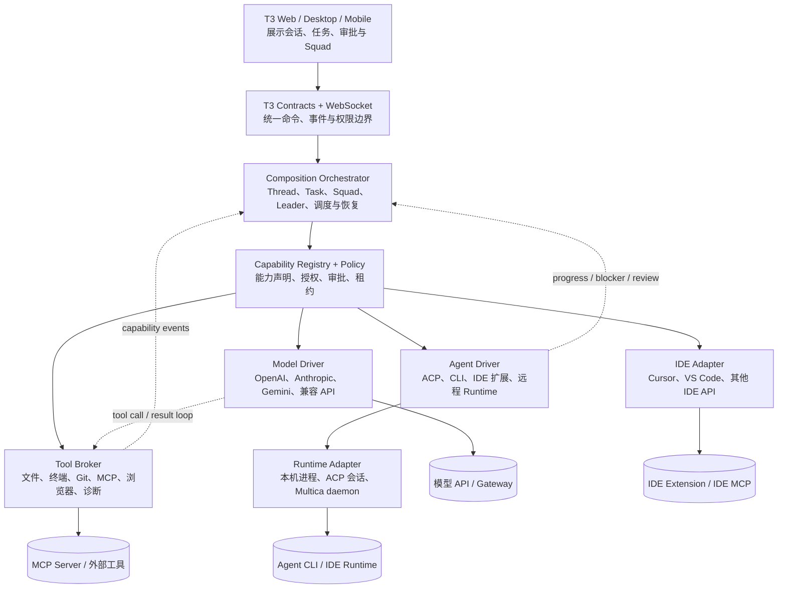

# Design: t3-byok-agent-squad-composition

## Architecture

本设计的目标是保留 T3 Code 的 Web、Desktop、Mobile 壳与现有 WebSocket/Contracts 边界，在其后增加可组合的 Agent 运行时、模型 API、工具、IDE 和多 Agent 协同层。关键原则是：模型供应商不是 Agent，Agent 运行时也不是 IDE；五者通过能力合同组合。

### 组件职责

- `ModelDriver` 只负责模型请求、流式增量、模型工具调用格式和 provider 兼容；它不能直接读写工作区，也不能自行决定 IDE 权限。
- `AgentDriver` 负责一个 Agent Runtime 的启动、恢复、取消、进度和终态。CLI、ACP、IDE 扩展和 Multica daemon 都属于这一层。
- `ToolBroker` 是 T3 主机托管的统一工具入口。模型直连模式与外部 Agent 模式都必须经过能力声明、授权和审批；外部 Runtime 可以通过 ACP/MCP 接收工具配置，但最终授权仍由 T3 policy 决定。
- `IDEAdapter` 只暴露当前 IDE 已连接且真实声明的 API。不能因为配置中出现 `cursor`、`vscode` 或 `browser` 字样就假设工具可用。
- `CompositionOrchestrator` 负责任务图、Squad、Leader、队列、并发、租约、心跳、重试、取消、结果汇总和人工 review；它不实现任何 provider 协议细节。
- `MulticaAdapter` 作为可选的外部兼容适配器，复用 Multica 的 Agent、Runtime、Task、Squad 语义和 daemon 进程，不把 Multica 的数据库或服务端作为 T3 的唯一事实源。

### 关键闭环

模型驱动的 Agent Loop 必须是：模型请求 -> 工具声明 -> Tool Broker 准入 -> 审批或自动授权 -> 工具执行 -> 工具结果回填 -> 继续模型请求。只有完成这个闭环，BYOK 模型才真正拥有 T3 文件、终端、MCP 或 IDE 能力；单独接入 `/chat/completions`、`/messages` 或 Gemini 流并不能产生 Agent 能力。

多 Agent 协同采用“Leader 先判断，再派发”的默认策略：Squad 任务先交给 Leader，Leader 通过稳定的成员引用创建子任务；子任务回报进度、阻塞、结果或 review 请求后，Orchestrator 再唤醒 Leader。只有显式声明任务依赖可并行且工具租约不冲突时才做 fan-out，避免多个 Agent 同时修改同一工作区造成不可解释的结果。

## Interfaces

### 1. 能力注册与授权

- `CapabilityRegistry.list(input)`
  - Input: `{ scope: "workspace" | "agent" | "task", scopeId: string }`
  - Output: `{ capabilityId: string, kind: "model" | "tool" | "mcp" | "ide" | "runtime", providerId?: string, version?: string, status: "available" | "degraded" | "unavailable", grants: { read: boolean, execute: boolean, mutate: boolean }, approval: "never" | "on_first_use" | "every_use", source: "t3" | "runtime" | "ide" | "multica" }[]`
  - Error codes: `capability_scope_not_found`, `capability_registry_unavailable`。
  - Invariants: 只返回当前真实探测到的能力；`available` 不等于已授权；不返回 API Key、Cookie、完整请求体或 IDE 私有凭据。

- `CapabilityPolicy.evaluate(input)`
  - Input: `{ taskId: string, agentId: string, capabilityId: string, operation: string, resource?: string, destructive: boolean }`
  - Output: `{ decision: "allow" | "approval_required" | "deny", reasonCode: string, approvalRequestId?: string, expiresAtUnixMs?: number }`
  - Error codes: `task_not_found`, `agent_not_found`, `capability_not_granted`, `resource_out_of_scope`, `policy_invalid`。
  - Invariants: 运行时声明、Agent 授权、Task 授权和资源范围必须全部满足；拒绝不能被驱动本地配置覆盖。

### 2. 统一模型驱动合同

- `ModelDriver.start(input)`
  - Input: `{ providerInstanceId: string, modelId: string, threadId: string, taskId: string, messages: Message[], tools?: ToolDescriptor[], responseMode: "text" | "agent_loop", metadata?: Record<string,string> }`
  - Output: `{ modelRunId: string, acceptedAtUnixMs: number, effectiveModelId: string, advertisedToolNames: string[] }`
  - Error codes: `model_provider_unavailable`, `model_not_found`, `model_request_invalid`, `model_context_overflow`, `model_auth_failed`。
  - Invariants: `agent_loop` 模式下只能发送经过 Tool Broker 过滤的工具；provider 原始工具名必须映射回稳定的 canonical tool name。

- `ModelDriver.stream(modelRunId)`
  - Output event union: `text_delta`、`reasoning_delta`、`tool_call_opened`、`tool_call_delta`、`tool_call_completed`、`usage_updated`、`model_error`、`model_completed`。
  - Invariants: 同一 `toolCallId` 的增量必须有序；终态事件只能出现一次；重试不得重复提交已产生外部副作用的工具调用。

- `ModelDriver.submitToolResult(input)`
  - Input: `{ modelRunId: string, toolCallId: string, canonicalToolName: string, result: ToolResult, isError: boolean }`
  - Output: `{ accepted: boolean }`
  - Error codes: `model_run_not_found`, `tool_call_not_pending`, `tool_result_invalid`, `model_run_terminal`。
  - Invariants: 结果必须与待处理的 `toolCallId`、Task 和 Agent 绑定；不得通过调用方提交的 provider 名称绕过准入映射。

### 3. 统一工具与 MCP 合同

- `ToolBroker.invoke(input)`
  - Input: `{ taskId: string, agentId: string, toolCallId: string, canonicalToolName: string, arguments: unknown, approvalToken?: string, idempotencyKey: string }`
  - Output: `{ invocationId: string, status: "succeeded" | "failed" | "denied" | "cancelled", result?: unknown, errorCode?: string, startedAtUnixMs: number, finishedAtUnixMs: number }`
  - Error codes: `tool_not_registered`, `tool_arguments_invalid`, `tool_approval_required`, `tool_denied`, `tool_scope_denied`, `tool_execution_failed`, `tool_duplicate_invocation`。
  - Invariants: 同一 `idempotencyKey` 不得重复产生写入副作用；路径、命令、MCP server、IDE 会话都必须通过 policy；结果进入模型前必须脱敏和限长。

- `MCPBroker.resolve(input)`
  - Input: `{ taskId: string, agentId: string, requestedServers: string[], requestedTransports: ("stdio" | "http" | "sse")[] }`
  - Output: `{ serverId: string, transport: string, toolNames: string[], resourceNames: string[], status: "connected" | "degraded" | "denied" }[]`
  - Error codes: `mcp_server_not_found`, `mcp_transport_unsupported`, `mcp_trust_required`, `mcp_scope_denied`。
  - Invariants: 仅以运行时 `tools/list`、资源列表和传输能力为准；不能按服务名称猜测能力；对外部 ACP Runtime 的 MCP 配置必须是 Task 作用域。

### 4. Agent Driver 合同

- `AgentDriver.probe(input)`
  - Input: `{ driverKind: "acp" | "cli" | "ide" | "multica", executable?: string, runtimeId?: string }`
  - Output: `{ runtimeId: string, driverKind: string, version?: string, status: "online" | "offline" | "unstable", capabilities: string[], supportedModels?: string[], supportsResume: boolean, supportsMcp: boolean }`
  - Error codes: `runtime_not_found`, `runtime_probe_failed`, `runtime_protocol_invalid`。
  - Invariants: `supportsMcp`、`supportsResume` 和 IDE 能力必须来自真实握手或明确的 Runtime 描述，不得由静态名称推断。

- `AgentDriver.startTask(input)`
  - Input: `{ taskId: string, agentId: string, runtimeId: string, workspaceRoot: string, prompt: string, model?: string, toolGrantIds: string[], mcpGrantIds: string[], parentTaskId?: string, resumeToken?: string }`
  - Output: `{ runId: string, runtimeTaskId?: string, status: "dispatched" | "waiting_runtime" | "running" }`
  - Error codes: `runtime_offline`, `workspace_lock_conflict`, `agent_access_denied`, `task_dispatch_failed`, `resume_unsupported`。
  - Invariants: 工作区路径必须由 T3 Project 解析；父子 Task 关系不可由 Runtime 自行改写；外部 Runtime 只能使用本次授予的环境变量、MCP 和工具。

- `AgentDriver.cancelTask(input)`
  - Input: `{ taskId: string, runId: string, reason: string }`
  - Output: `{ status: "cancel_requested" | "cancelled" | "already_terminal" }`
  - Invariants: 取消父任务时必须明确子任务策略；不能把“停止等待”错误投影为“子任务已完成”。

### 5. Squad 与 Task 合同

- `Squad.create(input)`
  - Input: `{ name: string, leaderAgentId: string, memberAgentIds: string[], instructions?: string, roles?: { agentId: string, description: string }[] }`
  - Output: `{ squadId: string, leaderAgentId: string, memberAgentIds: string[] }`
  - Error codes: `squad_name_invalid`, `leader_not_allowed`, `member_not_allowed`, `agent_archived`。
  - Invariants: Leader 必须是 Agent；成员角色描述只用于路由提示，不授予能力；每个成员仍受自身 Access 和 T3 capability policy 约束。

- `Task.dispatch(input)`
  - Input: `{ taskId: string, assignee: { kind: "agent" | "squad", id: string }, prompt: string, projectId: string, parentTaskId?: string, dependsOnTaskIds?: string[], mode: "serial" | "parallel" | "review" }`
  - Output: `{ taskId: string, runId: string, status: "queued" | "dispatched" | "blocked_by_dependency" }`
  - Error codes: `task_dependency_cycle`, `task_assignee_unavailable`, `task_project_not_found`, `task_dispatch_duplicate`。
  - Invariants: 相同父任务与相同幂等键不得重复派发；`parallel` 只有在工作区租约和工具 grants 不冲突时生效。

- `Task.appendEvent(input)`
  - Input: `{ taskId: string, runId: string, type: "progress" | "blocker" | "message" | "review_requested" | "tool" | "status", summary: string, data?: Record<string,unknown> }`
  - Output: `{ eventId: string, sequence: number }`
  - Error codes: `task_run_not_found`, `task_event_out_of_order`, `task_event_payload_invalid`。
  - Invariants: 事件按 Task/Run 单调递增；日志默认保存摘要、工具名、错误码和时间，不保存密钥、完整 prompt 或未经脱敏的 IDE 内容。

### 6. IDE API 合同

- `IDEAdapter.resolve(input)`
  - Input: `{ taskId: string, requestedProfile: string, connectedSessions?: string[] }`
  - Output: `{ sessionId: string, profile: "cursor_ide" | "vscode_ide" | "browser_mcp" | "unknown", verifiedOperations: string[], status: "ready" | "incomplete" | "unavailable" }`
  - Error codes: `ide_not_connected`, `ide_profile_ambiguous`, `ide_capability_incomplete`, `ide_operation_unsupported`。
  - Invariants: 必须根据真实 Runtime/Extension/MCP 描述符选择 profile；未知 profile 不得降级为猜测执行。

- `IDEAdapter.execute(input)`
  - Input: `{ taskId: string, agentId: string, sessionId: string, operation: string, arguments: unknown, approvalToken?: string, idempotencyKey: string }`
  - Output: `{ status: "succeeded" | "failed" | "denied", resultSummary?: string, screenshotAssetId?: string, errorCode?: string }`
  - Invariants: 只返回稳定摘要或显式资产引用；URL、Cookie、Token、完整 DOM、IDE 内部协议帧和凭据不得进入普通历史或模型回放。

### 7. T3 客户端事件合同

- `composition.task.event`
  - Payload: `{ taskId, runId, parentTaskId?, agentId, runtimeId?, status, sequence, eventType, summary, progress?: number, blockerCode?: string, approvalRequestId?: string, childTaskIds?: string[] }`
  - 状态集合: `queued`、`dispatched`、`running`、`waiting_approval`、`waiting_input`、`blocked`、`in_review`、`completed`、`failed`、`cancelled`、`timed_out`。
  - Invariants: 移动端、Web、Desktop 使用同一事件与终态；客户端刷新后从持久化投影恢复，不以本地 spinner 作为事实源。

## Data Model

### 核心实体

- `ModelProviderInstance`
  - `id`、`driverKind`、`displayName`、`configRef`、`enabled`、`capabilities`、`createdAt`、`updatedAt`。
  - `configRef` 只引用 T3 Secret Store 中的 API Key、token 或环境变量名；禁止把秘密写入 Task、事件或客户端快照。

- `AgentDriverProfile`
  - `id`、`kind`、`runtimeId`、`modelProviderInstanceId?`、`executableRef?`、`version?`、`status`、`supportsResume`、`supportsMcp`、`capabilities`、`lastHeartbeatAt`。
  - `kind=ide` 时必须关联 `IDEConnection`；`kind=multica` 时保存外部 daemon 的运行时标识，不保存 Multica 服务端的完整凭据。

- `Agent`
  - `id`、`name`、`instructions`、`driverProfileId`、`modelRef?`、`skillRefs`、`accessPolicy`、`executionPolicy`、`archivedAt?`。
  - Agent 是可复用身份与配置，不等同于长驻进程；一次实际执行必须创建 `TaskRun`。

- `CapabilityGrant`
  - `id`、`subjectKind`、`subjectId`、`capabilityId`、`operations`、`resourceScopes`、`approvalMode`、`expiresAt?`、`issuedBy`。
  - 权限计算必须同时考虑 Workspace、Agent、Task 三层；更窄范围覆盖更宽范围，拒绝优先。

- `Squad`
  - `id`、`name`、`leaderAgentId`、`instructions`、`archivedAt?`。

- `SquadMember`
  - `squadId`、`memberKind`、`memberId`、`roleDescription`、`sortOrder`。
  - `roleDescription` 不授予权限，也不自动触发成员执行；它只提供给 Leader 做路由判断。

- `CompositionTask`
  - `id`、`projectId`、`threadId?`、`parentTaskId?`、`assigneeKind`、`assigneeId`、`mode`、`status`、`promptDigest`、`createdAt`、`updatedAt`、`finishedAt?`。
  - `parentTaskId` 形成有向无环图；禁止自引用、循环依赖和跨 Project 的隐式工作区写入。

- `TaskDependency`
  - `taskId`、`dependsOnTaskId`、`condition`（`success`、`terminal`、`review_approved`）、`createdAt`。

- `TaskRun`
  - `id`、`taskId`、`agentId`、`runtimeId`、`runtimeTaskId?`、`status`、`attempt`、`leaseId?`、`startedAt?`、`finishedAt?`、`failureCode?`、`resultSummary?`。
  - 一个 Task 可以有多次 Run；重试创建新 Run，不覆盖旧 Run。

- `TaskEvent`
  - `id`、`taskId`、`runId`、`sequence`、`type`、`summary`、`payloadDigest?`、`createdAt`。
  - 事件是前端与恢复流程的事实源；大 payload、原始模型帧和敏感正文进入隔离的本地调试存储，不进入普通事件投影。

- `ToolInvocation`
  - `id`、`taskId`、`runId`、`toolCallId`、`canonicalToolName`、`argumentsDigest`、`status`、`idempotencyKey`、`approvalRequestId?`、`resultDigest?`、`createdAt`、`finishedAt?`。

- `RuntimeLease`
  - `id`、`runtimeId`、`taskId`、`workspaceRootDigest`、`heartbeatAt`、`expiresAt`、`state`。
  - 同一可写工作区默认只能有一个有效写租约；只读任务可以并行，但仍需显式声明。

- `IDEConnection`
  - `id`、`kind`、`profile`、`sessionRef`、`verifiedOperations`、`status`、`lastProbeAt`。
  - 不持久化 Cookie、Token、完整 IDE 协议帧或未经脱敏的页面内容。

### 状态与不变量

- `TaskRun` 允许 `queued -> dispatched -> running`，运行中可进入 `waiting_approval`、`waiting_input` 或 `blocked`，之后只能回到 `running` 或进入终态。
- `completed`、`failed`、`cancelled`、`timed_out` 是不可逆终态；`in_review` 是交付前状态，不能自动等价为 `completed`。
- Squad Leader 的 dispatch 只创建子任务并保留父任务为 `running`；所有目标达成后才可将父任务置为 `in_review`，最终 `done` 仍由人工或明确的外部集成确认。
- 对同一 Task、ToolCall、RuntimeLease 和外部 daemon command 使用幂等键；取消、重试和 Runtime 重连都必须能重复收到而不重复产生副作用。

## Key Decisions

### 决策一：模型驱动与 Agent 驱动分离

- Problem: 把 BYOK API、Codex/Claude/Cursor CLI 和 IDE API 都塞进一个 Provider 接口，会让“能生成文本”被误判为“能执行工具”，也会让某个 CLI 的权限模型泄漏到其他驱动。
- Solution: `ModelDriver` 只处理模型协议，`AgentDriver` 只处理 Runtime 生命周期，`ToolBroker` 统一托管工具与审批，`IDEAdapter` 只处理真实 IDE 会话。
- Cost: 配置和事件合同比单一 Provider 接口更多；一项新能力需要声明它属于模型、Runtime、工具还是 IDE。
- Why not alternatives: 继续扩展单一 Provider 会复制造适配器分支；让模型 API 直接执行工具会绕过 T3 权限和审计；完全依赖外部 CLI 又无法让 BYOK API 使用 T3 原生工具。

### 决策二：采用 Multica 语义，不直接把 Multica 当 T3 核心后端

- Problem: 直接把 Multica 的服务端、数据库和 board 作为 T3 的事实源，会引入另一套用户、Workspace、Issue、Task、Runtime 和权限生命周期；两套壳之间的恢复、删除、审计和离线语义会分裂。
- Solution: T3 自己持久化 Agent、Task、Squad、Run、Event 和 Capability；通过 `MulticaAdapter` 对接外部 daemon 或 CLI，映射 Agent/Runtime/Task/Squad 的最小协议，并保留外部 `runtimeTaskId` 做关联。
- Cost: 需要维护映射和能力降级；Multica 新增的云端 board、通知或自动化不会自动变成 T3 原生功能。
- Why not alternatives: 直接 fork Multica 会失去 T3 现有 Provider、Checkpoint 和多端合同；只复制“同时启动多个进程”又没有 Leader、阻塞、review、恢复和执行记录语义；完全不接 Multica 则重复实现其成熟的 Runtime/Task 协同模型。

## Migration / Compatibility

### 当前 T3 与 `cursor-byok` 差异矩阵

状态含义：`已具备` 表示 T3 当前分支有可复用实现；`部分迁移` 表示有相近代码但不能证明同等闭环；`未迁移` 表示在 T3 当前分支未形成对应产品能力。这里不把“某仓库存在代码”误写成“已经接入另一个仓库”。

| 能力 | `cursor-byok` 证据 | T3 当前分支证据 | 状态 | 结论 |
|---|---|---|---|---|
| BYOK 多实例、供应商与模型目录 | `internal/client/model_catalog.go`、`internal/client/provider_balance*.go`、供应商配置前端 | `apps/server/src/provider/Drivers/ByokDriver.ts`、`apps/server/src/provider/Layers/ByokAdapter.ts`、`packages/contracts/src/byokDiscovery.ts`、`byokBalance.ts` | 已具备 | T3 已迁移基础 BYOK 配置、发现和余额能力。
| OpenAI/Anthropic/Gemini 兼容 | `internal/backend/agent/model/openai*.go`、`anthropic*.go`、`gemini.go` | T3 BYOK adapter 与 model adapter | 部分迁移 | T3 能调用三类协议，但 `cursor-byok` 的 tool schema 清洗、XML tool protocol、路由重试、replay safety 等兼容细节尚未形成等价层。
| 模型工具调用闭环 | `internal/backend/agent/model/tool_admission.go`、`tool_schema_normalize.go`、`internal/backend/agent/bridge/exec/tool_registry.go` | `ByokAdapter.ts` 模块说明明确声明没有 structured tool input/output、permission flow，Agentic tool use 走 delegation executor | 未迁移到 T3 BYOK | 这是最关键缺口；需要 ModelDriver + ToolBroker + approval + result loop。
| T3 文件、终端、Git、MCP 工具接入 BYOK | `internal/backend/agent/bridge/exec/exec_open_fs.go`、`exec_open_shell.go`、`exec_open_git.go`、MCP bridge | T3 有 Workspace、Terminal、MCP、Preview，但 BYOK 直连模式没有证明进入同一 tool loop | 部分迁移 | 工具本身存在，驱动接线和权限闭环缺失。
| 多种 Agent executor | `internal/backend/delegation/executors/claude.go`、`codex.go`、`cursor.go`、`gemini.go`、`kiro.go`、`custom.go` | T3 原生 ProviderDriver 已有 Codex、Claude、Cursor、Grok、OpenCode；BYOK delegation 只有一个 configured executor command | 部分迁移 | T3 可启动多种原生 Provider，但 BYOK delegation 还不是多 executor registry。
| 原生 Task/Subagent 生命周期 | `exec_open_task.go`、`exec_subagent_await.go`、`delegation_native_runtime.go`、`delegation_multitask.go` | T3 有 Thread/Turn/Provider runtime、Orchestration 和基础 delegation scheduler | 部分迁移 | T3 需要把父子 Task、子代理结果回传、取消、续租、看门狗和恢复统一进 Composition Orchestrator。
| 自动模型匹配、健康度、余额路由与 failover | `internal/client/auto_match_context.go`、`internal/backend/agent/model/router*.go`、`retry.go`、`replay_safety.go` | T3 当前主要是显式 Provider Instance/Model 选择和模型探测；已有能力可作为策略输入 | 部分迁移 | 需要独立 Routing Policy，不应塞进 AgentDriver。
| Cursor 账号、多账号切换与恢复 | `internal/backend/cursoraccount`、`internal/bridge/cursor_account_compat.go` | T3 未见 Cursor 专属账号存储/登录/导入导出合同 | 未迁移 | 列为 Cursor 兼容层，不阻塞通用多驱动架构。
| Cursor MITM、CA、relay、官方请求镜像、Bidi/RunSSE | `internal/mitm`、`internal/bridge/cursor_protocol_history.go`、`requestlab` 相关代码 | T3 WebSocket/Provider 流不等价于 Cursor MITM | 未迁移 | 不应作为 ModelDriver 的隐式副作用；需要隔离的 CursorCompatAdapter。
| Cursor Skills/MCP 控制面与 IDE Browser | `internal/cursorcapabilities`、`internal/backend/forwarder/computeruse_bridge.go`、Skills/MCP 扫描 | T3 有 MCP/Preview automation，但没有 Cursor 安装版控制面合同 | 部分迁移 | 通过 IDEAdapter 按运行时 descriptor 选择 profile，未知能力拒绝执行。
| Request Lab、Control Center、配置恢复、诊断 | `internal/requestlab`、`internal/controlcenter`、`internal/diagnostics`、`internal/config` | T3 有 Settings/ServerConfig/Checkpoint，但未见等价 Cursor 诊断与协议实验室 | 未迁移 | 作为后续兼容与运维面，不放入核心 Agent 合同。
| Multica Agent/Runtime/Task/Squad/Leader | Multica 官方 `README.md`、`docs/concepts`、`docs/agents`、`docs/squads`、`docs/tasks`、`CLI_AND_DAEMON.md` | T3 当前有 Provider、Thread、Turn、Orchestration、BYOK scheduler，但无持久化 Squad/Leader/Task graph 语义 | 未迁移 | 新增 `Composition Orchestrator` 和可选 `MulticaAdapter`。

### 分期建议

1. **阶段 A：合同与能力注册**。新增 ModelDriver、AgentDriver、ToolBroker、IDEAdapter、CapabilityGrant、TaskRun 和事件合同；复用现有 T3 ProviderInstance、Thread、Checkpoint、MCP、Workspace 和审批事件。
2. **阶段 B：BYOK Agent Loop**。先让 OpenAI-compatible、Anthropic-compatible、Gemini 三类 BYOK 在 T3 Tool Broker 上完成工具声明、准入、审批、执行、结果回填和取消；每个协议保留自己的 schema/retry adapter。
3. **阶段 C：多 Agent Runtime**。把 T3 原生 Codex/Claude/Cursor/Grok/OpenCode 与 `cursor-byok` 的 Claude/Codex/Cursor/Gemini/Kiro/Custom executor 归入 AgentDriver Registry，统一探测、恢复、日志、Task Run 和能力协商。
4. **阶段 D：Multica Squad 语义**。实现 Agent、Runtime、Task、Squad、Leader、子任务、阻塞、进度、review、重试和心跳；默认采用 Leader 串行派发，独立且租约不冲突的节点才允许并行。
5. **阶段 E：IDE API 适配**。先以 MCP/ACP 作为通用通道，再为 Cursor、VS Code 等 IDE 增加显式 adapter；每个 IDE 能力必须有运行时探测、权限授予和不可用降级。
6. **阶段 F：Cursor 专属兼容层**。最后迁移 Cursor 账号、多账号、MITM/CA、relay、协议镜像、Request Lab、Control Center、Skills/MCP 控制面和安装版能力诊断；这些能力不能反向污染通用 ModelDriver。

### 兼容与安全边界

- T3 原生 Provider 的现有 `ProviderAdapterShape`、WebSocket 事件和三端客户端继续工作；新增合同通过 optional capability 字段和新事件类型扩展，不改变已有文本会话语义。
- 旧 BYOK 配置继续按现有 adapter/provider instance 读取；没有 `agent_loop` 授权时保持纯文本模式，不暗中启用文件写入或终端执行。
- 外部 Multica daemon 只作为 Runtime 执行端。T3 必须在 dispatch 前下发本次 Task 的 workspace、MCP、工具和环境变量 grants；不得把 T3 的长期 API Key 注入外部进程。
- Multica 官方文档明确说明 daemon 默认以操作系统用户权限运行，默认不保证文件系统沙箱；因此 T3 的高风险默认应是独立运行用户、容器或虚拟机边界，而不是把“有 Tool Broker”误认为已经完成 OS 级隔离。
- `cursor-byok` 的未提交修改保持不动；本设计只记录其当前代码证据，不把现有 dirty worktree 当成已发布合同。

### 证据登记

- 本地检索日期：2026-08-25；T3 分支 HEAD `51cffa02`，父仓库 HEAD `37b9e750`，`cursor-byok` HEAD `2ce7481`。两个仓库的未提交状态分别按当前工作区事实处理。
- 本地证据：`E:/MyProject/code-work/t3code/apps/server/src/provider/ProviderDriver.ts`、`ProviderAdapter.ts`、`Layers/ByokAdapter.ts`、`provider/byok/ByokDelegationService.ts`、`orchestration/byokDelegation/DelegationScheduler.ts`、`packages/contracts/src/providerRuntime.ts`；`E:/MyProject/cursor-byok/internal/backend/agent`、`delegation`、`forwarder`、`routing`、`mitm`、`requestlab`、`controlcenter`、`cursoraccount`、`cursorcapabilities`、`computeruse`、`skills`、`terminalenv`。
- 外部检索关键词：`multica-ai multica GitHub agent squad task daemon runtime`、`site:github.com/multica-ai/multica Agent Squad Task daemon runtime`；访问日期：2026-08-25；采用来源为 Multica 官方 GitHub README、官方 `CLI_AND_DAEMON.md` 和官方文档 `concepts`、`agents`、`squads`、`tasks`、`security-model`，因为这些是项目作者维护的架构、协议和安全边界说明，优先于第三方介绍。
